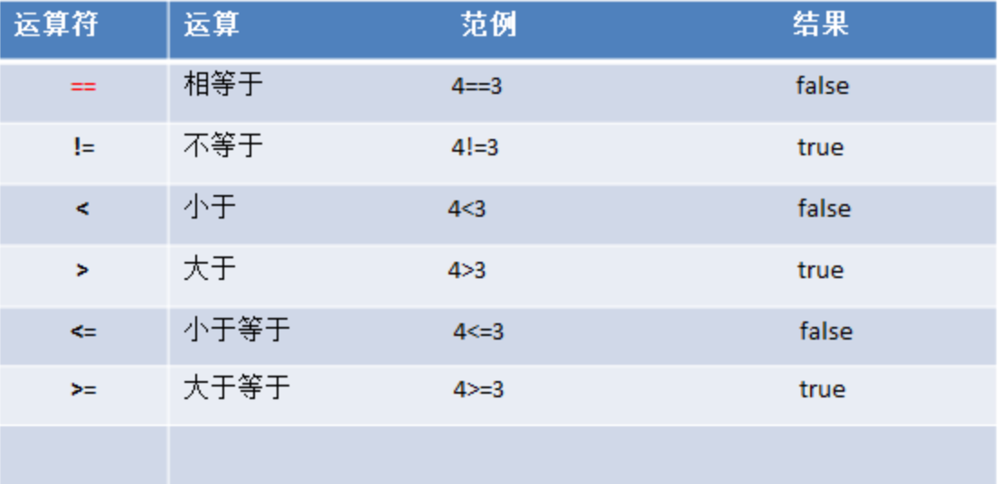
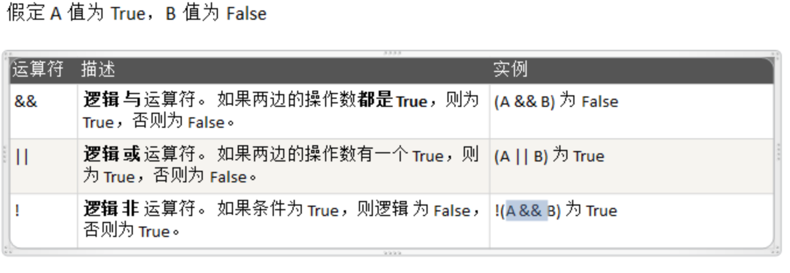
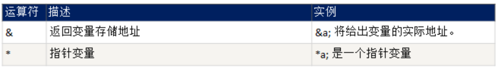

### 1. GO语言特点
1. 从C语言继承了很多理念，包括表达式语法，控制结构，基础数据类型等等

2. 引入包的概念，用于组织程序结构，Go语言的一个文件都要归属于一个包，而不能单独存在

3. 垃圾回收机制，内存自动回收，不需要开发人员管理

4. 天然并发

   1. 从语言层面支持并发，实现简单

   2. goroutine，轻量级线程，**可实现大并发处理，高效利用内核**

   3. 基于CPS并发模型(Communicating Sequential Process) 实现

5. 管道通信机制，形成Go语言特有的管道channel，通过管道channel可以实现不同的goroute之间的通信

6. 函数返回多个值

7. 新的创新：切片slice、延时执行defer等

#### 1.1 Golang环境变量
1. GOROOT:指定go sdk安装目录
2. Path: 指定sdk/bin 目录
3. GOPATH: Golang工作目录，我们所有项目的源码放到这个目录下

### 2. Go快速入门

```
package main
import "fmt"

func main(){
	fmt.Println("hello Golang")
}
```

#### 2.1 Golang执行流程分析

- 两种运行方式
  1. 源文件 .go—— go build ——> 可执行文件(.exe或可执行文件) —— 运行 ——> 结果
  2. 源文件 .go—— go run ——> 结果
- 两种执行方式的区别：
  1. 如果先编译成可执行文件，该可执行文件可以在没有go开发环境的机器上运行
  2. 如果直接用 go run 运行，如果在另外机器上这么运行，需要go开发环境
  3. 在编译时，编译器会将运行依赖的库文件包含在可执行文件中，可执行文件会变大很多

#### 2.2 Go程序开发注意事项

1.  Go源文件以“go”为扩展名
2. Go应用程序的执行入口是main()函数
3. Go语言严格区分大小写
4. Go方法一条条语句构成，每个语句后不需要分号(Go语言会在每行后自动加分号)
5. Go编译器是一行一行进行编译的，因此我们一行就写一条语句，不能把多条语句写在同一，否则报错
6. Go语言定义的变量或者import的包如果没有使用到，代码不能通过编译
7. 大括号要成对出现，缺一不可

#### 2.3 Go常用转义字符(escape char)

1. \t : 一个制表位，实现对齐的功能
2. \n: 换行符
3. \\\ : 一个\
4. \\" : 一个"
5. \\r: 一个回车

#### 2.4 注释
- 行注释 \\\
- 块注释 \ \* *\

#### 2.5 规范的代码风格
- 正确的使用行注释
    - 推荐使用行注释
    - 看Go源码
- 正确使用缩进
    - gofmt命令格式化
- 行长约定：一行最长不超过80个字符，超过的请使用换行展示。

### 3 Golang-变量
#### 3.1 变量：

- 变量相当于内存中一个数据存储空间的表示
- 该空间有自己的变量名和数据类型
- Golang变量使用的三种方式：
    - 指定变量类型，声明后若不赋值，使用默认值
    - 根据值自行判定变量类型(类型推导)
    - 省略var，注意 := 左侧的变量不应该是已经声明过的，否则导致编译错误
- 多变量声明：golang支持一次性声明多个变量
- 该区域的数值可以在同一类型范围内不断变化
- 变量在同一作用域内不能重名
- 变量=变量名+值+数据类型
- Golang的变量如果没有赋值，编译器会使用默认值

示例：
```
// 定义全局变量
var m1 = 100
var m2 = "test"
var m3 = 1.1
// 一次性声明
var(
	m5 = "aaa"
	m6 = 1212
)

func main() {
	//变量
	// 1. var 声明变量
	var i int 
	fmt.Println("i =",i)
	// 2. 类型推导
	var j = 10
	fmt.Println("j =",j)
	// 3. 使用 :=
	name := "roger"
	fmt.Println("name =",name)
	// 4. 声明多个变量
	//4.1
	var n1, n2, n3 int 
	fmt.Println("n1 =", n1, "n2 =", n2, "n3 =", n3)
    //4.2
	var a1, a2, a3 = "aaa3", 111, "aaa2"
	fmt.Println("a1 =", a1, "a2 =", a2, "a3 =", a3)
	//4.3
	b1, b2, b3 := "bbb3", 111, "bbb2"
	fmt.Println("b1 =", b1, "b2 =", b2, "b3 =", b3)

	fmt.Println("m1 =",m1,"m2 =",m2,"m3 =",m3,"m5 =",m5,"m6 =",m6)

}
```
声明变量：
- var 变量名 数据类型

变量初始化：
- var a int = "test"

程序中➕号的使用
1. 当左右两边都是数值型时，则做加法运算
2. 当左右两边都是字符串，则做字符串拼接

#### 3.2 数据类型
- 基本数据类型
  - 数值型
    - 整数型
    - 浮点类型
      - 单精度 float32 占 4个字节
      - 双精度 float64 占 8个字节
  - 字符型
    - golang没有专用的字符
  - 布尔型
  - 字符串
- 派生/复杂数据类型
  - 指针
  - 数组
  - 结构体
  - 管道
  - 函数
  - 切片
  - 接口
  - map

- 整型的使用细节：
  - Golang各整数类型分：有符号和无符号，int uint的大小跟操作系统有关
  - Golang默认声明的是int型
  - 查看程序中某个变量占用字节大小和数据类型
  - Golang程序中整型变量在使用时，最受保小不保大的原则
- 小数类型/浮点数使用细节
  - Golang浮点类型有固定的范围和字段长度，不受操作系统影响
  - Golang浮点类型默认声明为float64类型
  - 浮点型常量有两种表示形式
  - 通常情况下，应该使用float64，因为它比float32更精确

- 字符类型
  - 字符常量是用单引号括起来的单个字符，比如 var a byte = 'a'
  - Go中允许使用转义字符 \ 来将其后的字符转义变为特殊字符型常量 
  - Go语言的字符使用UTF-8编码
  - 在Go中，字符的本质是一个整数，直接输出时，是字符对应的UTF-8编码的码值
  - 直接给某个变量赋值一个数字，然后按格式化输出时%c，会输出该数字对应的unicode字符
  - 字符类型是可以进行运算的，相当于一个整数，因为它都对应有Unicode码
  - 如果保存的字符在ASCII表，可以直接保存为byte
  - 如果我们保存的字符对应码值大于255，这时我们可以考虑使用int类型保存 
  - 如果我们需要按照字符的方式输出，这时我们需要格式化输出，即 fmt.Printf("d=%c"，c) 

- 布尔类型 bool
  - 布尔类型也叫bool类型，bool类型数据只允许取值true和false 
  - bool类型占1个字节
  - boolean类型适于逻辑运算，一般用于程序流程控制 

- 字符串类型: 
  - Go的字符串是由单个字节连接起来的，Go语言的字符串的字节使用UTF-8编码标识Unicode文本
  - 字符串一旦赋值了，字符串就不能修改了：** 在Go中字符串是不可变的  **
  - 字符串的两种表示形式
    1. 双引号，会识别转义符
    2. 反引号，以字符串的原生形式输出，包括换行和特殊字符，可以实现防止攻击，输出源代码效果 
    3. 字符串的拼接方式 +
    4. 当一个字符串拼接操作特别长，怎么办？可以分行写，但注意，需要将+保留在上一行

- 基本数据类型的默认值
  - 整型：0
  - 浮点数：0
  - 字符串：""
  - 布尔类型：false 

- 基本数据类型的转换
  - Golang和java/c不同，Go在不同类型的变量之间赋值时，需要**显式的转换**。也就是说Golang中数据类型不能自动转换
  - 基本用法：
    - 表达式Type(value)，将值 value 转换为类型 T

- 基本数据类型和string的转换
  - 实现基本数据类型和string类型的相互装换
    - 基本类型转string类型
      1. fmt.Sprintf("%参数"，表达式)
        - 参数需要和表达式的数据类型相匹配
        - fmt.Sprintf()返回转换后的字符串
      2. 使用strconv包的函数
        - strconv.FormatBool
        - strcovn.FormatInt
    - string转基本数据类型
      - 使用strconv包的函数
        - strconv.ParseBool
        - strconv.ParseFloat
        - strconv.ParseInt
        - strconv.ParseUint
  - 注意：string转基本数据类型，要确保string可以转为一个有效数据，如果将“hello”转为数据，Golang将会把值处理为0

- 指针
  1. 基本数据类型，变量存的就是值，也叫值类型
  2. 获取变量的地址，用&，比如： var num int，获取num的地址：&num
  3. 指针类型，变量存的是一个地址，这个地址指向的空间存的才是值，比如：var ptr \*int = &num
  4. 获取指针类型所指向的值，使用：\*, 比如：var ptr \*int，使用\*ptr 获取ptr指向的值
  - 使用细节：
    - 值类型，都有对应的指针类型，形式为 \*数据类型，比如int的对应的指针就是 \*int，float32对应的指针类型就是 \*float32 依次类推
    - 值类型包括: 基本数据类型int系列，float系列，bool，string，数组，结构体struct

#### 3.3 值类型和引用类型
1. 值类型：
  - 基本数据类型int系列，float系列，bool，string，数组，结构体struct
2. 引用类型：
  - 指针，slice切片，map，管道chan，interface等都是引用类型
- 特点：
  1. 值类型：变量直接存储值，内存通常在栈中分配
  2. 引用累心: 变量存储的是一个地址，这个地址对应的空间才是真正存储的数据值，内存通常在堆上分配，当没有任何变量引用这个地址时，该地址对应的数据空间成为一个垃圾，由GC来回收

#### 3.4 标识符的命名规范
- 标识符概念：
  1. Golang 对各种变量、方法、函数等命名时，使用的字符序列称为标识符
- 标识符命名规则：
  1. 由26个英文字母大小写，0-9，\_组成
  2. 不可以以数字开头
  3. Golang中严格区分大小写
  4. 标识符不能包含空格
  5. 下划线 \_ 本身在Go中是一个特殊的标识符，称为**空标识符**。可以代表任何其它的标识符，但是它对应的值会被忽略(比如:忽略某个返回值)，所以仅能被作为占位符使用，不能作为标识符使用，
  6. 不能使用系统**保留关键字**作为标识符

- 注意事项：
  1. 包名：保持package的名字和目录保持一致，尽量采取有意义的包名，简短，有意义，不要和标准库冲突
  2. 变量名、函数名、常量名: 驼峰写法
  3. 如果变量名、函数名、常量名首字母大写，则可以被其他的包访问；如果首字母小写，则只能在本包内使用(注：可以简单的理解为：首字母大写是公开的，首字母小写是私有的 )

- 关键字：

###  4 运算符
#### 4.1 运算符介绍
- 运算符是一种特殊的符号，用以表示数据的运算、赋值和比较等
  1. 算术运算符
  2. 赋值运算符
  3. 比较运算符/关系运算符
  4. 逻辑运算符
  5. 位运算符
  6. 其他运算符

#### 4.2 算术运算符
- 加减乘除、取模，自增、自减、连接字符串

#### 4.3 关系运算符
- 关系运算符的结果都是bool型，要么是true，要么是false
- 关系表达式经常在**if结构**的条件中或循环结构的条件中
  
#### 4.4 逻辑运算符
- 用于连接多个条件(一般来讲就是关系表达式)，最终的结果bool值
  
#### 4.5 赋值运算符
- 赋值运算符就是将某个运算后的值，赋给指定的变量
#### 4.6 位运算符
#### 4.7 其他运算符


### 5 流程控制
1. 顺序控制
2. 分支控制
3. 循环控制
#### 5.1 顺序控制
- 自上而下顺序执行
#### 5.2 分支控制
- 单分支控制
- 双分支控制
- 多分支控制
- 嵌套分支

#### 5.3 switch 分支
- 定义：
  switch语句用于基于不同条件执行不同动作，每一个case分支都是唯一的，从上到下逐一测试，直到匹配到为止，匹配项后面不需要加break

- 基本语法：
```
switch 表达式 {
    case 表达式1，表达式2，...:
        语句块1
    case 表达式3，表达式4，...:
        语句块2
    
    default:
        语句块
}
```

- 注意细节：
  1. case 后是一个表达式(即：常量值，变量，一个有返回值的函数等都可以)

  2. case 后的各个表达式的值的数据类型，必须和switch的表达式数据类型一致

  3. case 后面可以带多个表达式，使用逗号间隔，比如：case 表达式1，表达式2

  4. case 后面的表达式如果是常量值(字面量)，则要求不能重复

  5. case 后面不需要带break，程序匹配到一个case后，执行对应的代码块，然后退出switch，如果没有匹配到case，则执行default

  6. default 语句不是必须的

  7. switch 后可以不带表达式，类似 if---else 分支来使用

  8. switch 后也可以直接声明/定义一个变量，分号结束，不推荐

  9. switch穿透 fallthrough， 如果在case语句块后增加fallthrough，则会继续执行下一个case

  10. Type Switch：switch语句还可以被用于 tpye-switch 来判断某个 interface 变量中实际指向的变量类型

#### 5.4 for循环控制
- 示例
```
	for i:=0; i<10; i++ {
		fmt.Println("i=",i)
	}
```
- 基本语法
  for 循环变量初始化;循环条件;循环变量迭代{
    循环操作
  }

```
用法：
// 第一种写法
// 
	i := 1
	for ; i<3; i++ {
		fmt.Println("aaa",i)

	}
	fmt.Println("i=",i)

	for j:=1; j<3; j++ {
		fmt.Println("jjj",j)

	}


// 第二种写法
	n := 1
	for n <= 3 {
		fmt.Println("n=",n)
		n++
	}


// 第三种写法。死循环，一般配合break使用（go没有while（do..while）的实现，可以实现类似while或 do...while用法），等价于 for ; ; {...}
	 for {
	 	fmt.Println("aaa")
	 }

	k := 1
	for ; ; {
		if k < 3 {
			fmt.Println("hahaha")
		} else {
			break
		}
		k ++
	}
	
// 第四种： Go提供for-range的方式，可以方便遍历字符串和数组
// 字符串遍历 传统方式
	var sss string = "hello world"
	for i := 0; i < len(sss); i++ {
		fmt.Printf("%c \n",sss[i])
	}
	//字符串遍历 for-range
	var ss string = "123 456"
	for index, val := range ss {
		fmt.Printf("index=%d, val=%c \n", index, val)
	}
注意： 如果我们的字符串含有中文，那么传统的遍历字符串方式是错误的，会出现乱码。原因是传统的对字符的遍历是按照字节来遍历，而一个汉字在utf8编码对应的是3个字节
如何解决 需要将 str 转换成 []rune 切片
str2 := []rune(str)
```

#### 5.5 跳转控制 break


