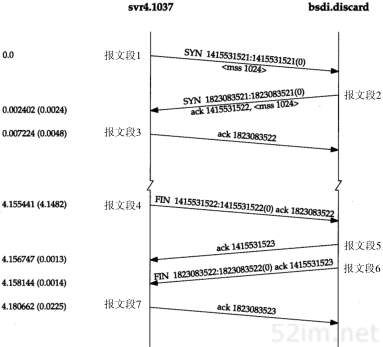
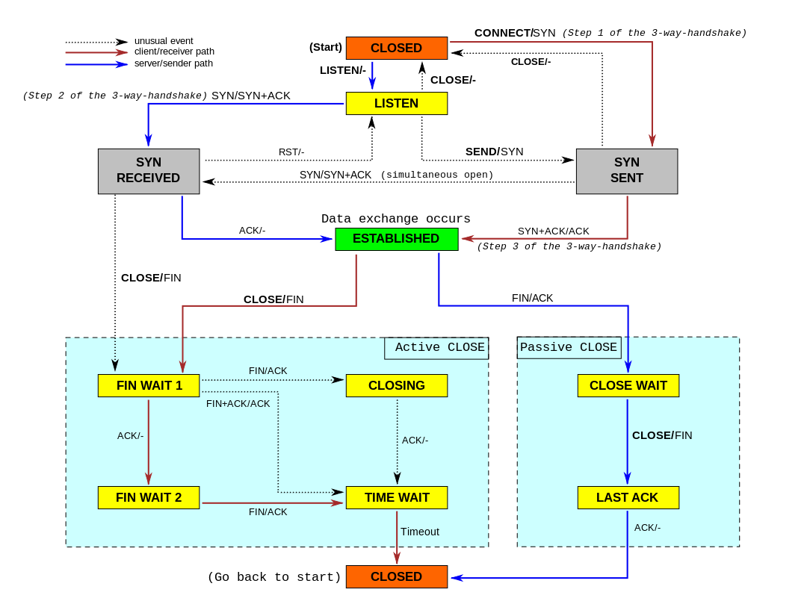

tcp连接相关

### 1. tcp介绍

tcp可靠传输主要解决网络问题（延迟高，不稳定等）




### 2. tcp 标志位（9比特）说明
- NS：ECN-nonce
- CWR：Congestion Window Reduced
- ECE：ECE-Echo有两种意思。取决于SYN标志的值
- URG：为1表示高优先级的数据包，紧急指针字段有效
- ACK：为1表示确认号，字段有效
- PSH：为1表示是带有PUSH标志的数据，指示接收方应该尽快将这个报文段交给应用层而不用等待缓冲区装满
- RST：为1表示出现严重差错。可能需要重新创建TCP连接。还可以用于拒绝非法报文段和拒绝连接请求
- SYN：为1表示这是连接请求或是连接接受请求，用于创建连接和使顺序号同步
- FIN：为1表示发送方没有数据要传输了，要求释放连接

*注：* 以上说明是为了抓包分析用

### 3. 状态编码说明
TCP状态码列表，以S指服务器，C指客户端，S&C表示两者，S/C表示两者之一：

- LISTEN S
  - 服务器等待从任意远程TCP端口的连接请求。监听状态。
- SYN-SENT C
  - 客户在发送连接请求后等待匹配的连接请求。通过connect()函数向服务器发出一个同步(SYNC)信号后进入此状态
- SYN-RECEIVED S
  - 服务器已经收到并发送同步(SYNC)信号之后等待确认(ACK)请求
- ESTABLISH S&C
  - 服务器与客户端的连接已经打开，收到的数据可以发送给用户。数据传输步骤的正常情况，此时连接两端是平等的，这称作全连接
- FIN-WAIT-1 S&C
  - (服务器或客户端)主动关闭端调用close()函数发送FIN请求包，表示本方的数据发送全部结束，等待TCP连接另一端端ACK确认包或者FIN&ACK请求包
- FIN-WAIT-2 S&C
  - 主动关闭端在FIN-WAIT-1状态下收到ACK确认包，进入等待远程TCP的连接终止请求的半关闭状态。这时可以接收数据，但不再发送数据
- CLOSE-WAIT S&C
  - 被动关闭端接到FIN后，就发出ACK以回应FIN请求，并进入等待本地用户的连接终止请求的半关闭状态。这时可以发送数据，但不再接收数据
- CLOSING S&C
  - 在发出FIN后，又收到对方发来的FIN后，进入等待对方对己方的连接终止（FIN）的确认（ACK）的状态。少见
- LAST-ACK S&C
  - 被动关闭端全部数据发送完成之后，向主动关闭端发送FIN，进入等待确认包的状态
- TIME-WAIT S/C
  - 主动关闭端接收到FIN后，就发送ACK包，等待足够时间以确保被动关闭端收到了终止请求的确认包。【按照RFC 793，一个连接可以在TIME-WAIT保证最大四分钟，即[最大分段寿命](https://zh.wikipedia.org/wiki/%E6%9C%80%E5%A4%A7%E5%88%86%E6%AE%B5%E5%AF%BF%E5%91%BD)（maximum segment lifetime）的2倍】
- CLOSED S&C
  - 完全没有连接

### 4. linux中time_wait优化

- 因为TCP连接是双向的，所以在关闭连接的时候，两个方向各自都需要关闭。先发FIN包的一方执行的是主动关闭；后发FIN包的一方执行的是被动关闭。主动关闭的一方会进入TIME_WAIT状态，并且在此状态停留两倍的MSL时长。

- 穿插一点MSL的知识：MSL指的是报文段的最大生存时间，如果报文段在网络活动了MSL时间，还没有被接收，那么会被丢弃。以Linux为例，通常是半分钟，两倍的MSL就是一分钟，也就是60秒

- TIME_WAIT两个MSL的作用：可靠安全的关闭TCP连接。比如网络拥塞，主动方最后一个ACK被动方没收到，这时被动方会对FIN开启TCP重传，发送多个FIN包，在这时尚未关闭的TIME_WAIT就会把这些尾巴问题处理掉，不至于对新连接及其它服务产生影响。

- TIME_WAIT关闭的危害：
  - 网络情况不好时，如果主动方无TIME_WAIT等待，关闭前个连接后，主动方与被动方又建立起新的TCP连接，这时被动方重传或延时过来的FIN包过来后会直接影响新的TCP连接；
  - 旧的TCP连接已经不存在了，系统此时只能返回RST包

#### 4.1 Linux实现的tips
	Linux使用了一种“子状态”的机制，即在进程退出的时候，单方面发送FIN，然后不等后续的关闭序列即将连接拷贝到一个占用资源更少的TW套接字，状态直接转入TIMW_WAIT，此时记录一个子状态FIN_WAIT_2，接下来的套接字就和原来的属于进程描述符的连接没有关系了。等到新的连接到来的时候，直接匹配到这个主状态为TW，子状态为FIN_WAIT_2的TW连接上，它负责处理FIN，FIN ACK等数据。


#### 4.2 tcp连接相关说明

##### tcp_tw_recycle：

​	回收TIME_WAIT连接

​	陷阱：当多个客户端通过NAT方式联网并与服务端交互时，服务端看到的是同一个IP，也就是说对服务端而言这些客户端实际上等同于一个，可惜由于这些客户端的时间戳可能存在差异，于是乎从服务端的视角看，便可能出现时间戳错乱的现象，进而直接导致时间戳小的数据包被丢弃。（tcp_tw_recycle和tcp_timestamps导致connect失败问题。同时开启情况下，60s内同一源ip主机socket 请求中timestamp必须是递增的）

##### tcp_tw_reuse：

​	复用TIME_WAIT连接。TIME_WAIT创建时间必须超过一秒才可能会被复用；二来只有连接的时间戳是递增的时候才会被复用。

​	使用地方：发起连接方使用。client连接server端，在server端设置无用。php连接数据库时，php为客户端，此时可复用该连接。

​	如果客户端可控的话，那么在服务端打开[KeepAlive](http://en.wikipedia.org/wiki/HTTP_persistent_connection)，尽可能不让服务端主动关闭连接，而让客户端主动关闭连接

​	当客户端端等待超过一定时间后自动给服务端发送一个空的报文，如果对方回复了这个报文证明连接还存活着，如果对方没有报文返回且进行了多次尝试都是一样，那么就认为连接已经丢失，客户端就没必要继续保持连接了。

##### KeepAlive:

在设置之前我们先来看看KeepAlive都支持哪些设置项

1. KeepAlive默认情况下是关闭的，可以被上层应用开启和关闭
2. tcp_keepalive_time: KeepAlive的空闲时长，或者说每次正常发送心跳的周期，默认值为7200s（2小时）
3. tcp_keepalive_intvl: KeepAlive探测包的发送间隔，默认值为75s
4. tcp_keepalive_probes: 在tcp_keepalive_time之后，没有接收到对方确认，继续发送保活探测包次数，默认值为9（次）

##### Linux内核设置
```
KeepAlive默认不是开启的，如果想使用KeepAlive，需要在你的应用中设置SO_KEEPALIVE才可以生效。
查看当前的配置：
$ cat /proc/sys/net/ipv4/tcp_keepalive_time
$ cat /proc/sys/net/ipv4/tcp_keepalive_intvl
$ cat /proc/sys/net/ipv4/tcp_keepalive_probes 

在Linux中我们可以通过修改 /etc/sysctl.conf 的全局配置：

net.ipv4.tcp_keepalive_time=7200
net.ipv4.tcp_keepalive_intvl=75
net.ipv4.tcp_keepalive_probes=9 

添加上面的配置后输入 sysctl -p 使其生效，你可以使用 sysctl -a | grep keepalive 命令来查看当前的默认配置
如果应用中已经设置SO_KEEPALIVE，程序不用重启，内核直接生效

net.ipv4.tcp_tw_reuse=1
TIME_WAIT复用：一般一个单独的主机是不可能在MSL内用同一个端口连接同一个服务的，除非它做了bind
如果能保证以下任意一点，一个TW状态的四元组(即一个socket连接)可以重新被新到来的SYN连接使用：
1. 初始序列号比TW老连接的末序列号大
2. 如果使用了时间戳，那么新到来的连接的时间戳比老连接的时间戳大

net.ipv4.tcp_max_syn_backlog=8192
表示SYN队列的长度，默认为1024。增大队列长度为8192，可以容纳更多等待连接的TCP连接数 ——TCP半连接队列。

net.ipv4.tcp_max_tw_buckets=180000
表示系统同时保持TIME_WAIT套接字的最大数量，如果超过这个数字，TIME_WAIT套接字将立刻被清除并打印警告信息；
默认为180000。

net.core.somaxconn=128
TCP连接队列的大小，用于存放已经建立好的TCP连接，等待服务端应用listener accept进行处理，默认128 ——TCP连接队列。

net.ipv4.tcp_synack_retries=2
为了打开对端的连接，内核需要发送一个SYN并附带一个回应前面一个SYN的ACK。也就是所谓三次握手中的第二次握手。这个设置决定了内核放弃连接之前发送SYN+ACK包的数量。
```

更多内核参数参考：<http://www.pandan.xyz/2017/03/29/linux%20%E5%86%85%E6%A0%B8%E5%8F%82%E6%95%B0%E4%BC%98%E5%8C%96/>