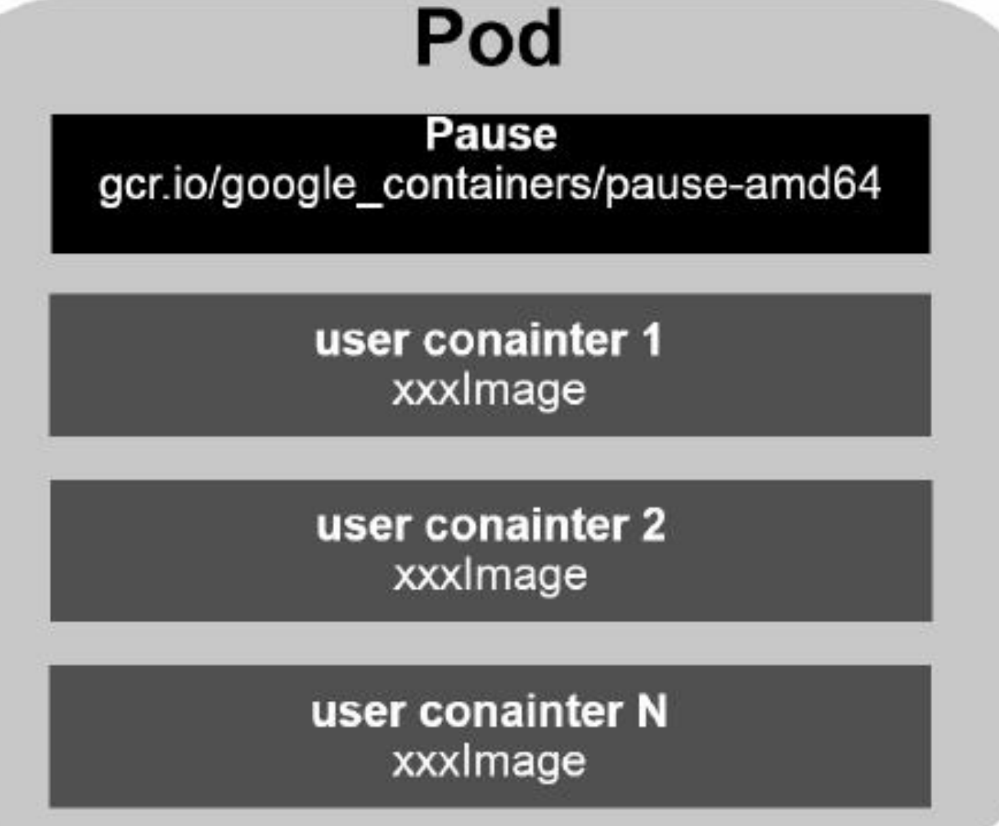
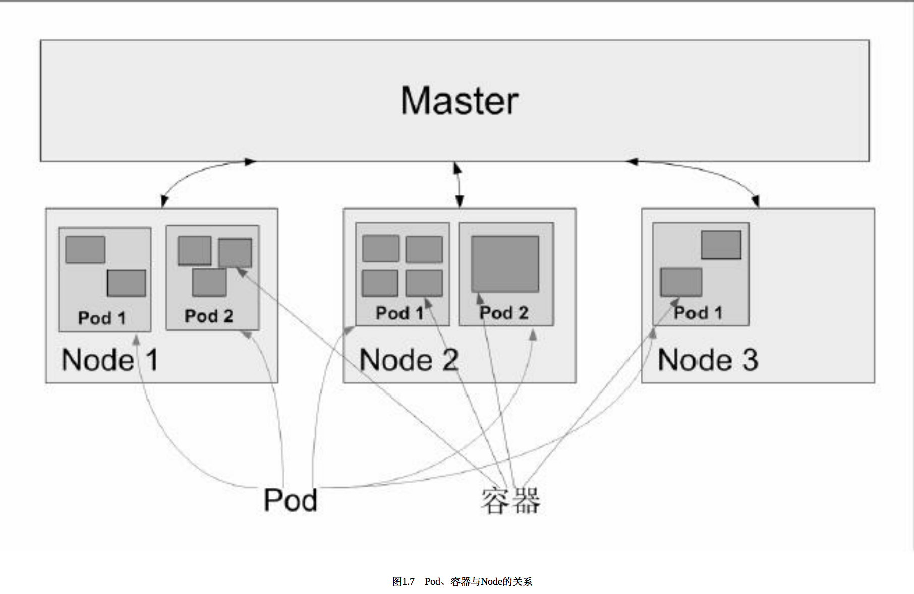
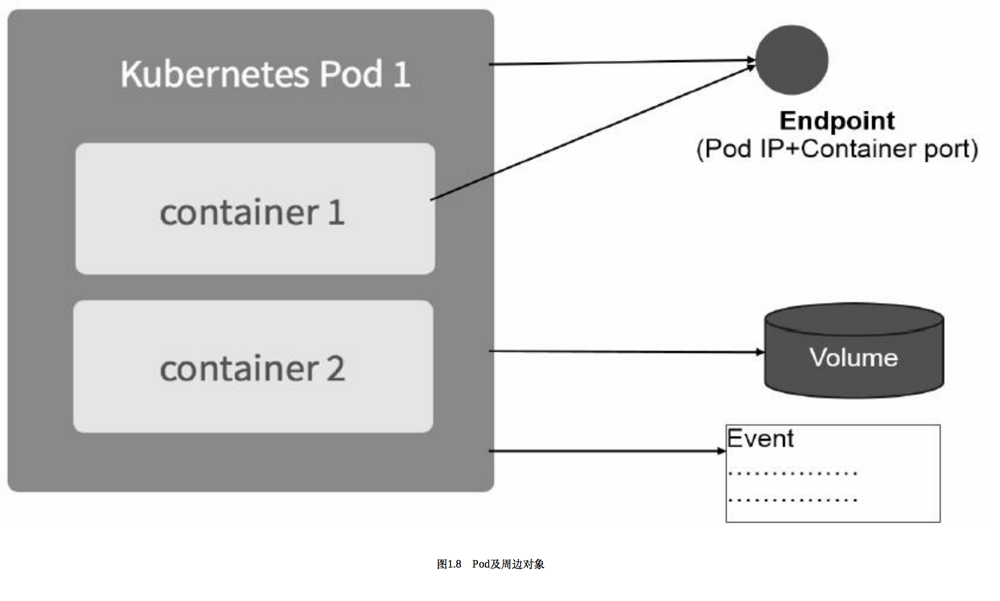

## k8s


## 一、Kubernetes 入门


### 1.1 kubernetes基础知识

- 在kubernetes中，Service(服务)是分布式集群架构的核心，一个Service对象拥有如下关键特征。
  - 拥有一个唯一指定的名字
  - 拥有一个虚拟IP(Cluster IP、Service IP 或 VIP) 和端口号
  - 能够提供某种远程服务的能力
  - 被映射到了提供这种能力的一组容器应用上
- 扩展service需要创建Repliction Controller，RC包括：
  - 目标Pod的定义
  - 目标Pod需要运行的副本数量(Replicas)
  - 要监控的目标Pod的标签(Label)

- 以上信息暂时不懂，不要紧，记住就好。


### 1.2 K8S 架构设计

- Kubernetes集群： Master组件 和 代理节点
- 
- K8S的核心组件
  - etcd 保存整个集群的状态
  - apiserver 提供了资源操作的唯一入口，并提供认证、授权、访问控制、api注册和发现等机制
  - controller manager 负责维护集群的状态，比如故障监测、自动扩展、滚动更新等
  - schedule 负责资源的调度，按照预定的调度策略将Pod调度到相应的机器上
  - kubelet 负责维护容器的生命周期，同时也负责管理Pods以及容器、镜像、Volume(CVI)和网络(CNI)的管理
  - container runtime 负责镜像管理以及Pod和容器的真正运行(CRI)
  - Kube-proxy 负责为Service提供cluster内部的服务发现和负载均衡
- 除了核心组件，还有一些推荐Add-one：
  - kube-dns 负载为整个集群提供DNS服务
  - Ingress Controller 为服务提供外网入口
  - Heapster 提供资源监控
  - Dashboard 提供GUI
  - Federation 提供跨可用区的集群
  - Fluentd-elasticsearch 提供集群日志采集、存储、查询

- 分层架构
  - 核心层：Kubernetes最核心的功能，对外提供API构建高层的应用，对内提供插件式应用执行环境
  - 应用层：部署(无状态应用、有状态应用、批处理任务、集群应用等)和路由(服务发现、DNS解析等)
  - 管理层：系统度量(如基础设施、容器和网络的度量)，自动化(如自动扩展、动态Provision)
  - 接口层：kubectl命令行工具、客户端SDK以及集群联邦
  - 生态系统：在接口层之上的庞大容器集群管理调度的生态系统，可以划分为两个范畴
    - kubernetes外部：日志、监控、配置管理、CI、CD、Workflow、Faas、OTS应用、ChatOps等
    - kubernetes内部：CRI、CNI、CVI、镜像仓库、Cloud Provider、集群自身的配置和管理等

### 1.3 开始搞

#### 1.3.1 环境准备

| 系统      | CentOS 7.4 |
| --------- | ---------- |
| kebunetes |            |
| Ectd      |            |

``` config
1. 关闭CentOS的自带防火墙服务
	# systemctl disable firewalld
  	# systemctl stop firewalld
  
2. 安装etcd和kubernetes软件 (会自动安装Docker软件)
  	# yum install -y etcd kubernetes
  	
3. 修改两个配置文件，其他保持默认
  	- Docker配置文件 /etc/sysconfig/docker, 其中OPTIONS的内容设置为：
  	  OPTIONS='--selinux-enabled=false --insecure-registry gcr.io'
  	- Kubernetes apiserver配置文件为/etc/kubernetes/apiserver，把--admission_control参数中的ServiceAccount删除。
  	
4. 按顺序启动所有服务：
  	#systemctl start etcd
    #systemctl start docker
    #systemctl start kube-apiserver
    #systemctl start kube-controller-manager
    #systemctl start kube-scheduler
    #systemctl start kubelet
    #systemctl start kube-proxy
      
  注：示例中的Docker镜像下载地址为https://hub.docker.com/u/kubeguide/
```

#### 1.3.2 启动mysql服务
##### 创建ReplicationController

创建RC定义文件，mysql-rc.yaml,实例如下：

``` yaml config
apiVersion: v1
kind: ReplicationController       ------------------# 副本控制器 RC
metadata:
    name: mysql                  ------------------# RC 名称，全局唯一
spec:
  replicas: 1                    ------------------# Pod 副本期待数量
  selector:
    app: mysql                   ------------------# 符合目标的 Pod 拥有此标签
  template:                      ------------------# 根据此模板创建 Pod 的副本(实例)
    metadata:
      labels:
        app: mysql               ------------------# Pod 副本拥有的标签，对应 RC 的 selector
    spec:
      containers:                ------------------# Pod 内容器的定义部分
      - name: mysql              ------------------# 容器的名称
        image: mysql             ------------------# 容器对应的 Docker Image
        ports:
        - containerPort: 3306    ------------------# 容器暴露的端口号
        env:                     ------------------# 注入到容器内的环境变量
        - name: MYSQL_ROOT_PASSWORD
          value: "123456"
```
- kind: 声明资源类型，上面是定义一个RC
- spec: 定义RC相关的属性

```
# 创建一个RC定义文件
# vim mysql-rc.yaml 
apiVersion: v1
kind: ReplicationController
metadata:
    name: mysql
spec:
  replicas: 1
  selector:
    app: mysql
  template:
    metadata:
      labels:
        app: mysql
    spec:
      containers:
      - name: mysql
        image: mysql
        ports:
        - containerPort: 3306
        env:
        - name: MYSQL_ROOT_PASSWORD
          value: "123456"

# 创建mysql
# kubectl create -f mysql-rc.yaml
replicationcontroller "mysql" created

# 查看RC状态
# kubectl get rc
NAME      DESIRED   CURRENT   READY     AGE
mysql     1         1         1         19h

# 查看pod的状态
# kubectl get pods              
NAME          READY     STATUS              RESTARTS   AGE
mysql-sdtf4   0/1       ContainerCreating   0          4s
```


##### 踩坑

kubectl create -f mysql-rc.yaml 状态一直卡在 ContainerCreating

```
# kubectl get pods              
NAME          READY     STATUS              RESTARTS   AGE
mysql-sdtf4   0/1       ContainerCreating   0          4s
状态一直是 ContainerCreating

# 查看详细信息 
# 注意：Event段：Event是一个事件的记录，记录了事件的最早产生时间、最后重现时间、重复次数、发起者、类型，以及导致此事件的原因等
kubectl describe pod mysql-sdtf4 
Name:           mysql-sdtf4
Namespace:      default
Node:           127.0.0.1/127.0.0.1
Start Time:     Tue, 24 Jul 2018 10:24:02 +0800
Labels:         app=mysql
Status:         Pending
IP:
Controllers:    ReplicationController/mysql
Containers:
  mysql:
    Container ID:
    Image:              mysql
    Image ID:
    Port:               3306/TCP
    State:              Waiting
      Reason:           ContainerCreating
    Ready:              False
    Restart Count:      0
    Volume Mounts:      <none>
    Environment Variables:
      MYSQL_ROOT_PASSWORD:      123456
Conditions:
  Type          Status
  Initialized   True 
  Ready         False 
  PodScheduled  True 
No volumes.
QoS Class:      BestEffort
Tolerations:    <none>
Events:
  FirstSeen     LastSeen        Count   From                    SubObjectPath   Type            Reason          Message
  ---------     --------        -----   ----                    -------------   --------        ------          -------
  24s           24s             1       {default-scheduler }                    Normal          Scheduled       Successfully assigned mysql-sdtf4 to 127.0.0.1
  23s           13s             2       {kubelet 127.0.0.1}                     Warning         FailedSync      Error syncing pod, skipping: failed to "StartContainer" for "POD" with ErrImagePull: "image pull failed for registry.access.redhat.com/rhel7/pod-infrastructure:latest, this may be because there are no credentials on this request.  details: (open /etc/docker/certs.d/registry.access.redhat.com/redhat-ca.crt: no such file or directory)"

解决方式：
# wget http://rpmfind.net/linux/centos/7.5.1804/os/x86_64/Packages/python-rhsm-certificates-1.19.10-1.el7_4.x86_64.rpm
# wget http://rpmfind.net/linux/centos/7.5.1804/os/x86_64/Packages/python-rhsm-1.19.10-1.el7_4.x86_64.rpm

# yum remove *rhsm*
# rpm -ivh *.rpm
```

##### 创建service

创建service定义文件  mysql-svc.yaml

``` service
apiVersion: v1
kind: Service                  -----------------表明是Kebernetes Service
metadata:
  name: mysql                  -----------------Service的全局唯一名称
spec:
  ports:
    - port: 3306               -----------------Service提供服务的端口
  selector:                    -----------------Service对应的Pod拥有这里定义的标签
    app: mysql


# vim mysql-svc.yaml
apiVersion: v1
kind: Service    
metadata:
  name: mysql     
spec:
  ports:
    - port: 3306   
  selector:  
    app: mysql

# 创建mysql service
# kubectl create -f mysql-svc.yaml 
service "mysql" created

# 查看service状态
# kubectl get svc
NAME         CLUSTER-IP       EXTERNAL-IP   PORT(S)    AGE
kubernetes   10.254.0.1       <none>        443/TCP    19h
mysql        10.254.127.139   <none>        3306/TCP   6m
```

注意到MySQL服务被分配了一个值为10.254.127.139的ClusterIP地址，这是一个虚地址，随后，Kubernetes集群中其他新创建的Pod就可以通过Service的ClusterIP+端口号3306来连接和访问它了。

```
# 创建tomcat应用
# vim myweb-rc.yaml
apiVersion: v1
kind: ReplicationController
metadata:
    name: tomcat
spec:
  replicas: 2
  selector:
    app: tomcat
  template:
    metadata:
      labels:
        app: tomcat
    spec:
      containers:
      - name: tomcat
        image: kubeguide/tomcat-app:v1
        ports:
        - containerPort: 8080
        env:
          - name: MYSQL_SERVICE_HOST
            value: 'mysql'
          - name: MYSQL_SERVICE_PORT
            value: '3306'
# 注意到上面RC对应的Tomcat容器里引用了MYSQL_SERVICE_HOST=mysql这个环境变量，而“mysql”恰好是我们之前定义的MySQL服务的服务名

# vim myweb-svc.yaml 
apiVersion: v1
kind: Service    
metadata:
  name: tomcat   
spec:
  type: NodePort
  ports:
    - port: 8080
      nodePort: 30001   
  selector:  
    app: tomcat
# 注意type=NodePort和nodePort=30001的两个属性，表明此Service开启了NodePort方式的外网访问模式，在Kubernetes集群之外，比如在本机的浏览器里，可以通过30001这个端口访问myweb（对应到8080的虚端口上）。

```


### 1.4 Kubernetes基本概念术语

Kubernetes中的大部分概念如Node、Pod、ReplicationController、Service等都可以看作一种“资源对象”，几乎所有的资源对象都可以通过Kubernetes提供的kubectl工具（或者API编程调用）执行增、删、改、查等操作并将其保存在etcd中持久化存储。从这个角度来看，

**Kubernetes其实是一个高度自动化的资源控制系统，它通过跟踪对比etcd库里保存的“资源期望状态”与当前环境中的“实际资源状态”的差异来实现自动控制和自动纠错的高级功能。**(一种配置管理思路)

#### 1.4.1 Master

​	Master：集群的控制节点，每一个kubernetes集群都需要一个Master节点负责整个集群的管理和控制，基本上k8s所有的控制命令都是发给它，它来负责具体的执行过程。Master节点宕机或者不可用，所有的控制命令将失效。

   Master节点上的关键进程

- Kubernetes API Server（kube-apiserver），提供Http Rest接口的关键服务进程，是Kubernetes里所有资源的增删改查的唯一入口，也是集群控制的入口进程
- Kubernetes Controller Manager（kube-Controller-manager），Kubernetes里所有资源对象的自动化控制中心，资源对象的“大总管”
- Kubernetes Schedule（kube-schedule），负责资源调度(Pod调度)的进程

#### 1.4.2 Node

​	Node节点是Kubernetes集群中的工作负载节点，当某个Node宕机时，其上的工作负载会被Master自动迁移到其他节点上去。

  Node节点上关键进程：

- kubelet：负载Pod对应容器的创建、启停等任务，同时与Master节点密切协作，实现集群管理基本功能
- kube-proxy:  实现Kubernetes Service的通信与负载均衡机制的重要组件
- Docker Engine：Docker引擎，负责本机的容器创建和管理工作

```
# 查看nodes 
#  kubectl get nodes
NAME        STATUS    AGE
127.0.0.1   Ready     1d

# 查看某个nodes的详细信息
# kubectl describe node 127.0.0.1
Name:                   127.0.0.1
Role:
Labels:                 beta.kubernetes.io/arch=amd64
                        beta.kubernetes.io/os=linux
                        kubernetes.io/hostname=127.0.0.1
Taints:                 <none>
......
```


#### 1.4.3 Pod

Pod是Kubernetes的基本单位。

每一个Pod都有一个特殊"根容器" Pause 容器。 Pause容器对应的镜像属于k8s的一部分。



** 每个Pod都分配了一个唯一的IP地址，称之为Pod IP，一个Pod里的多个容器共享Pod IP地址。 Kubernetes要求底层网络支持集群内任意两个Pod之间的Tcp/IP直接通信，通常采用虚拟二层网络技术来实现，例如：Flannel、Openvswitch**

总结：在Kubernetes里，一个Pod里的容器与另外主机上的Pod容器能够直接通信。

   Pod其实有两种类型：普通的Pod及静态Pod（static Pod）

- 静态Pod：它并不存放在Kubernetes的etcd存储里，而是存放在某个具体的Node上的一个具体文件中，并且只在此Node上启动运行。
- 普通Pod: 配置保存在etcd中，master节点可以调度到具体的Node上运行。




定义一个Pod

```
apiVersion: v1
kind: Pod
metadata:
    name: first-pod
    labels:
      name: tomcat
spec:
  containers:
  - name: tomcat
    image: kubeguide/tomcat-app:v1
    ports:
    - containerPort: 8080
    env:
      - name: MYSQL_SERVICE_HOST
        value: 'mysql'
      - name: MYSQL_SERVICE_PORT
        value: '3306'
```

**说明：**Kind为Pod表明这是一个Pod的定义，metadata里的name属性为Pod的名字，metadata里还能定义资源对象的标签（Label），这里声明first-pod拥有一个name=tomcat的标签（Label）


​        每个Pod都可以对其能使用的服务器上的计算资源设置限额，当前可以设置限额的计算资源有CPU与Memory两种，其中CPU的资源单位为CPU（Core）的数量，是一个绝对值而非相对值。

​        一个CPU的配额对于绝大多数容器来说是相当大的一个资源配额了，所以，在Kubernetes里，通常以千分之一的CPU配额为最小单位，用m来表示。通常一个容器的CPU配额被定义为100～300m，即占用0.1～0.3个CPU。由于CPU配额是一个绝对值，所以无论在拥有一个Core的机器上，还是在拥有48个Core的机器上，100m这个配额所代表的CPU的使用量都是一样的。与CPU配额类似，Memory配额也是一个绝对值，它的单位是内存字节数。

   在Kubernetes里，一个计算资源进行配额限定需要设定以下两个参数。

- Requests：该资源的最小申请量，系统必须满足要求。
- Limits：该资源最大允许使用的量，不能被突破，当容器试图使用超过这个量的资源时，可能会被Kubernetes Kill并重启。

资源限制示例：

**限制tomcat容器申请最少0.25个cpu和64Mb内存，运行中最大使用资源0.5个cpu和128Mb内存**

```
apiVersion: v1
kind: Pod
metadata:
    name: first-pod
    labels:
      name: tomcat
spec:
  containers:
  - name: tomcat
    image: kubeguide/tomcat-app:v1
    resources:
           requests:
             memory: "64Mi"
             cpu: "250m"
           limits:
             memory: "128Mi"
             cpu: "500m"
    ports:
    - containerPort: 8080
    env:
      - name: MYSQL_SERVICE_HOST
        value: 'mysql'
      - name: MYSQL_SERVICE_PORT
        value: '3306'
```



