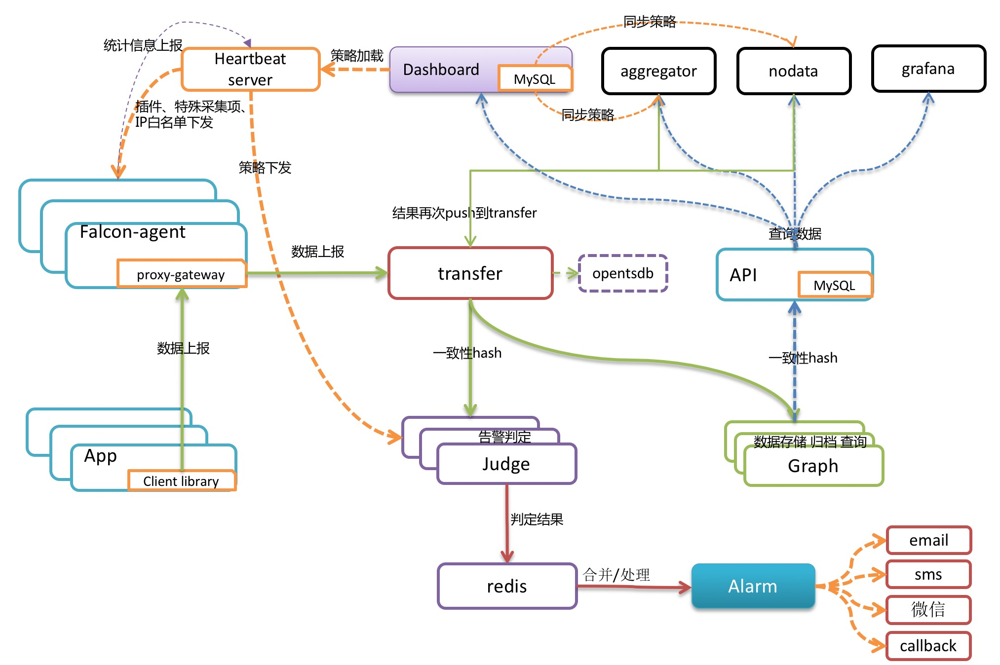

open-falcon快速入门

#### 一、特点

- 强大灵活的数据采集：自动发现，支持falcon-agent、snmp、支持用户主动push、用户自定义插件支持、opentsdb data model like（timestamp、endpoint、metric、key-value tags）
- 水平扩展能力：支持每个周期上亿次的数据采集、告警判定、历史数据存储和查询
- 高效率的告警策略管理：高效的portal、支持策略模板、模板继承和覆盖、多种告警方式、支持callback调用
- 人性化的告警设置：最大告警次数、告警级别、告警恢复通知、告警暂停、不同时段不同阈值、支持维护周期
- 高效率的graph组件：单机支撑200万metric的上报、归档、存储（周期为1分钟）
- 高效的历史数据query组件：采用rrdtool的数据归档策略，秒级返回上百个metric一年的历史数据
- dashboard：多维度的数据展示，用户自定义Screen
- 高可用：整个系统无核心单点，易运维，易部署，可水平扩展
- 开发语言： 整个系统的后端，全部golang编写，portal和dashboard使用python编写。

#### 二、 架构

		

#### 三、组件

1. Agent
   - Agent用于采集机器负载监控指标，比如cpu.idle， load.1min等信息，每隔60秒push给transfer。agent与transfer建立长连接，数据发送速度比较快，agent提供了一个http接口/v1/push用于手工push的一些数据，然后通过长连接迅速转发给transfer。
2. Transfer
   - transfer数据传输服务。接收agent上传的数据，然后按照哈希规则进行数据分片，并将分片后的数据分别push给graph和judge等组件。
3. Graph
   - graph是存储绘图数据的组件。接收transfer组件推送上来的监控数据，同时处理API组件的查询请求、返回绘图数据。
4. API
   - api组件提供统一的restAPI操作接口。比如：api组件接收查询请求，根据一致性哈希算法去响应的graph实例查询不同的metric的数据，然后汇总拿到的数据，最后统一返回给用户。
5. Heartbeat Server
   - 心跳服务器，所有agent会连接到HBS，每分钟发送一次心跳请求。agent如何知道自己应该采集哪些端口和进程呢？向HBS要，HBS去读取Portal的数据库，返回给agent。
   - hbs是可以水平扩展的，至少部署两个实例以保证可用性。一般一个实例可以搞定5000台机器，所以说，如果公司有10万台机器，可以部署20个hbs实例，前面架设lvs，agent中就配置上lvs vip即可。
6. Judge
   - Judge用于告警判断，agent将数据push给transfer，transfer不但会转发给graph组件来绘图，还会转发给judge用于判断是否触发告警。
   - Judge监听了一个http端口，提供了一个http接口：/count，访问之，可以得悉当前Judge实例处理了多少数据量。推荐的做法是一个Judge实例处理50万~100万数据，用个5G~10G内存，如果所用物理机内存比较大，比如有128G，可以在一个物理机上部署多个Judge实例。
7. Alarm
   - alarm模块是处理报警event的，judge产生的报警event写入redis，alarm从redis读取处理，并进行不同渠道的发送。
   - alarm是个单点。对于未恢复的告警是放到alarm的内存中的，alarm还需要做报警合并，故而alarm只能部署一个实例。需要对alarm的存活做好监控。
8. Task
   - task是监控系统一个必要的辅助模块。定时任务，实现了如下几个功能：
     - index更新。包括图表索引的全量更新 和 垃圾索引清理。
     - falcon服务组件的自身状态数据采集。定时任务了采集了transfer、graph、task这三个服务的内部状态数据。
     - falcon自检控任务。
9. Gateway
   - 多IDC时，可能面对 "分区到中心的专线网络质量较差&公网ACL不通" 等问题。这时，可以在分区内部署一套数据路由服务，接收本分区内的所有流量(包括所有的agent流量)，然后通过公网(开通ACL)，将数据push给中心的Transfer
10. Nodata
    - nodata用于检测监控数据的上报异常。nodata和实时报警judge模块协同工作，过程为: 配置了nodata的采集项超时未上报数据，nodata生成一条默认的模拟数据；用户配置相应的报警策略，收到mock数据就产生报警。采集项上报异常检测，作为judge模块的一个必要补充，能够使judge的实时报警功能更加可靠、完善。
11. Aggregator
    - 集群聚合模块。聚合某集群下的所有机器的某个指标的值，提供一种集群视角的监控体验。
12. 邮件/短信/微信发送接口
    - falcon为了适配各个公司，在接入方案上做了一个规范，需要各公司提供http的短信和邮件发送接口。
13. DashBoard
    - UI